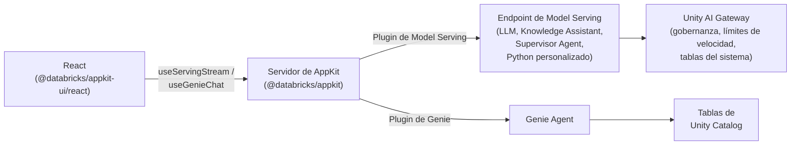

# ¿Qué es Agent Bricks? \{#what-is-agent-bricks\}

**Agent Bricks** es la plataforma de agentes empresariales de Databricks para crear, desplegar y gobernar agentes que operan sobre los datos de tu negocio. Unifica el acceso a modelos, la ejecución, la gobernanza y el contexto en un único sistema: desde el modelo que invocas hasta los datos que lee tu agente y la identidad con la que actúa. En tu workspace configuras Knowledge Assistants, Supervisor Agents y agentes personalizados en Python. Databricks se encarga de la evaluación, el ajuste y la mejora de la calidad, y después aloja cada agente en un endpoint HTTP que tu aplicación puede invocar.

Para saber qué es Agent Bricks y cómo desarrollar con él, consulta la [documentación de Agent Bricks](https://docs.databricks.com/aws/en/agents/agent-bricks/) o la agent skill [`databricks-agent-bricks`](/es/docs/tools/ai-tools/agent-skills).

Tu aplicación de AppKit se conecta a las capacidades de Agent Bricks mediante el [plugin de Model Serving](/es/docs/appkit/v0/plugins/model-serving), para agentes, modelos fundacionales y endpoints gobernados, y el [plugin de Genie](/es/docs/appkit/v0/plugins/genie), para consultas en lenguaje natural sobre tablas de Unity Catalog.

## Cómo encaja todo \{#how-it-fits-together\}

Tu aplicación de AppKit llama a Agent Bricks a través de un **endpoint de Model Serving** (un modelo fundacional, un Knowledge Assistant, un Supervisor Agent o un agente de Python personalizado) o de un **Genie Agent** (consultas en lenguaje natural sobre tablas de Unity Catalog). El [plugin de Model Serving](/es/docs/appkit/v0/plugins/model-serving) y el [plugin de Genie](/es/docs/appkit/v0/plugins/genie) cubren ambos casos.

## Plugins de AppKit para Agent Bricks \{#appkit-plugins-for-agent-bricks\}

| Lo que quieres hacer                                                                          | Plugin a usar | Helper de frontend                     |
| --------------------------------------------------------------------------------------------- | ------------- | -------------------------------------- |
| Llamar a un modelo fundacional (LLM) con mensajes de chat                                     | `serving`     | `useServingStream`, `useServingInvoke` |
| Llamar a un endpoint de agente (Knowledge Assistant, Supervisor Agent, Python personalizado)  | `serving`     | `useServingStream`, `useServingInvoke` |
| Ofrecer a los usuarios consultas en lenguaje natural sobre tablas de Unity Catalog            | `genie`       | `GenieChat`, `useGenieChat`            |

Elige el plugin que corresponda al recurso. No hace falta ninguna otra primitiva para la capa de IA.

## Auth \{#auth\}

Las rutas HTTP de serving y de Genie se ejecutan en nombre del usuario autenticado de forma predeterminada. Si el usuario no tiene `CAN QUERY` en el endpoint de serving o `CAN RUN` en el Genie Agent, la llamada falla con un 403. No hace falta que escribas la comprobación de permisos.

Para la lógica de servidor fuera de un manejador de rutas, llama a `AppKit.serving("alias").asUser(req).invoke(...)` para mantener el mismo comportamiento.

## Por qué AppKit en lugar de `fetch` a secas \{#why-appkit-instead-of-raw-fetch\}

Podrías llamar a un endpoint de serving directamente con `fetch` y un token. El plugin no hace nada que no puedas hacer tú mismo; simplemente se encarga de estas cosas para que tú no tengas que hacerlo:

* Las rutas se ejecutan como el usuario autenticado, por lo que los **permisos por usuario** se aplican automáticamente. Tus usuarios solo ven los endpoints y los datos a los que ya tienen acceso. Sin código de OAuth de tu parte. Consulta [Contexto de ejecución](/es/docs/appkit/v0/plugins/execution-context) para conocer los detalles.
* Todo el **streaming** se gestiona por ti: análisis de SSE, cancelación al desmontar, acumulación de tokens y manejo de errores. De eso se encargan `useServingStream` y `useGenieChat`.
* Sin **secretos** en el frontend. El plugin hace de proxy a través de tu servidor y los tokens permanecen en el backend. Sin PAT en el bundle de React.
* Cuando tu endpoint de serving publica un esquema de OpenAPI, AppKit genera **alias de endpoint tipados** con tipos de TypeScript para la solicitud y la respuesta de cada alias. Autocompletado para las formas de los chunks, en lugar de `unknown`.

:::note[Crear un agente personalizado]

Crear un agente personalizado es un flujo de trabajo de Python: la interfaz `ResponsesAgent`, un framework de agentes (OpenAI Agents SDK, LangGraph, LlamaIndex) y MLflow para el trazado. Consulta [Author an AI agent](https://docs.databricks.com/aws/en/agents/custom-agents/author-agent).

:::

## Elige una plantilla para empezar \{#pick-a-template-to-start-from\}

Parte de una plantilla que se ajuste a tu caso de uso. Cada una incluye la integración del plugin de Model Serving o Genie, un enlace de recursos en `app.yaml` y una interfaz funcional que puedes adaptar.

| Si quieres...                                                  | Plantilla                                                  |
| -------------------------------------------------------------- | ---------------------------------------------------------- |
| Añadir un chatbot con streaming a tu app                       | [AI Chat App](/es/templates/ai-chat-app)                      |
| Permitir que los usuarios consulten tablas en lenguaje natural | [Genie Analytics App](/es/templates/genie-analytics-app)      |
| Añadir el cambio entre varios agentes de Genie a una app existente | [Genie Multi-Agent Selector](/es/templates/genie-multi-space) |

## Qué sigue \{#where-to-next\}

* [Unity AI Gateway](/es/docs/agents/ai-gateway) para el acceso gobernado a modelos, endpoints de agentes y herramientas externas.
* [Genie Agents](/es/docs/agents/genie) para conversar con tus datos en tablas de Unity Catalog.
* [Endpoints de agentes personalizados](/es/docs/agents/custom-agents) para integrar Knowledge Assistant, Supervisor Agent o tu propio agente en Python.