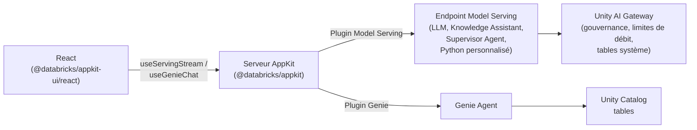

# Qu'est-ce qu'Agent Bricks ? \{#what-is-agent-bricks\}

**Agent Bricks** est la plateforme d'agents d'entreprise de Databricks, conçue pour créer, déployer et gouverner des agents qui exploitent vos données métier. Elle réunit au sein d'un même système l'accès aux modèles, l'exécution, la gouvernance et le contexte : du modèle que vous appelez aux données que votre agent consulte, en passant par l'identité sous laquelle il agit. Dans votre workspace, vous configurez des Knowledge Assistants, des Supervisor Agents et des agents Python personnalisés. Databricks se charge de l'évaluation, de l'optimisation et de l'amélioration de la qualité, puis héberge chaque agent derrière un endpoint HTTP que votre application peut appeler.

Pour en savoir plus sur Agent Bricks et sur la façon de développer avec, consultez la [documentation Agent Bricks](https://docs.databricks.com/aws/en/agents/agent-bricks/) ou la compétence d'agent [`databricks-agent-bricks`](/docs/tools/ai-tools/agent-skills).

Votre application AppKit se connecte aux fonctionnalités d'Agent Bricks via le [plugin Model Serving](/docs/appkit/v0/plugins/model-serving) pour les agents, les foundation models et les endpoints gouvernés, et via le [plugin Genie](/docs/appkit/v0/plugins/genie) pour les requêtes en langage naturel sur les tables Unity Catalog.

## Comment tout s&#39;articule \{#how-it-fits-together\}

Votre application AppKit appelle Agent Bricks via un **endpoint Model Serving** (un foundation model, un Knowledge Assistant, un Supervisor Agent ou un agent Python personnalisé) ou un **Genie Agent** (requêtes en langage naturel sur des tables Unity Catalog). Le [plugin Model Serving](/docs/appkit/v0/plugins/model-serving) et le [plugin Genie](/docs/appkit/v0/plugins/genie) couvrent ces deux cas.

## Plugins AppKit pour Agent Bricks \{#appkit-plugins-for-agent-bricks\}

| Votre objectif                                                                              | Plugin à utiliser | Utilitaire frontend                    |
| ------------------------------------------------------------------------------------------- | --------------- | -------------------------------------- |
| Appeler un foundation model (LLM) avec des messages de chat                                 | `serving`       | `useServingStream`, `useServingInvoke` |
| Appeler un endpoint d'agent (Knowledge Assistant, Supervisor Agent, Python personnalisé)    | `serving`       | `useServingStream`, `useServingInvoke` |
| Permettre aux utilisateurs d'interroger les tables Unity Catalog en langage naturel          | `genie`         | `GenieChat`, `useGenieChat`            |

Choisissez le plugin correspondant à la ressource. Aucune autre primitive n'est nécessaire pour la couche IA.

## Auth \{#auth\}

Les routes HTTP de serving et de Genie s'exécutent par défaut au nom de l'utilisateur authentifié. Si l'utilisateur ne dispose pas du droit `CAN QUERY` sur l'endpoint de serving ou `CAN RUN` sur le Genie Agent, l'appel échoue avec une erreur 403. Vous n'avez pas à écrire la vérification des permissions.

Pour la logique serveur en dehors d'un gestionnaire de route, appelez `AppKit.serving("alias").asUser(req).invoke(...)` afin de conserver le même comportement.

## Pourquoi AppKit plutôt qu'un `fetch` brut \{#why-appkit-instead-of-raw-fetch\}

Vous pourriez appeler un endpoint de serving directement avec `fetch` et un jeton. Le plugin ne fait rien que vous ne puissiez faire vous-même : il le fait simplement à votre place :

- Les routes s'exécutent en tant qu'utilisateur authentifié, si bien que les **permissions par utilisateur** s'appliquent automatiquement. Vos utilisateurs ne voient que les endpoints et les données auxquels ils ont déjà accès. Aucun code OAuth de votre côté. Voir [Contexte d'exécution](/docs/appkit/v0/plugins/execution-context) pour les détails.
- Tout le **streaming** est géré pour vous : analyse SSE, interruption au démontage, accumulation des jetons et gestion des erreurs. `useServingStream` et `useGenieChat` s'en chargent.
- Aucun **secret** dans le frontend. Le plugin relaie les requêtes via votre serveur et les jetons restent côté backend. Pas de PAT dans le bundle React.
- Lorsque votre endpoint de serving publie un schéma OpenAPI, AppKit génère des **alias d'endpoint typés**, avec des types TypeScript pour la requête et la réponse de chaque alias. De l'autocomplétion sur la forme des chunks, au lieu de `unknown`.

:::note[Créer un custom agent]

Créer un custom agent relève d'un workflow Python : l'interface `ResponsesAgent`, un framework d'agents (OpenAI Agents SDK, LangGraph, LlamaIndex) et MLflow pour le tracing. Voir [Author an AI agent](https://docs.databricks.com/aws/en/agents/custom-agents/author-agent).

:::

## Choisissez un modèle de départ \{#pick-a-template-to-start-from\}

Partez d'un modèle correspondant à votre cas d'usage. Chacun intègre la configuration du plugin Model Serving ou Genie, une liaison de ressource dans `app.yaml` et une interface fonctionnelle que vous pouvez adapter.

| Vous souhaitez...                                                     | Modèle                                                     |
| ------------------------------------------------------------------ | ---------------------------------------------------------- |
| Ajouter un chatbot en streaming à votre application                | [AI Chat App](/templates/ai-chat-app)                      |
| Permettre aux utilisateurs d'interroger des tables en langage naturel | [Genie Analytics App](/templates/genie-analytics-app)      |
| Ajouter le changement d'agent Genie à une application existante  | [Genie Multi-Agent Selector](/templates/genie-multi-space) |

## Pour aller plus loin \{#where-to-next\}

- [Unity AI Gateway](/docs/agents/ai-gateway) pour un accès gouverné aux modèles, aux endpoints d'agents et aux outils externes.
- [Genie Agents](/docs/agents/genie) pour dialoguer avec vos données dans les tables Unity Catalog.
- [Endpoints d'agents personnalisés](/docs/agents/custom-agents) pour connecter un Knowledge Assistant, un Supervisor Agent ou votre propre agent Python.