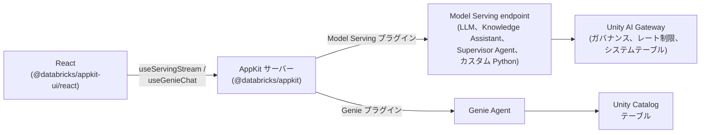

# Agent Bricks とは \{#what-is-agent-bricks\}

**Agent Bricks** は、ビジネスデータ上で動作するエージェントの構築、デプロイ、ガバナンスを実現する Databricks のエンタープライズ向けエージェントプラットフォームです。呼び出すモデル、エージェントが読み取るデータ、エージェントが実行時に使用するアイデンティティまで、モデルアクセス、実行、ガバナンス、コンテキストを単一のシステムに統合します。ワークスペースでは、Knowledge Assistant、Supervisor Agent、カスタム Python エージェントを構成できます。評価、チューニング、品質改善は Databricks が担当し、各エージェントはアプリから呼び出せる HTTP endpoint でホストされます。

Agent Bricks の概要と構築方法については、[Agent Bricks のドキュメント](https://docs.databricks.com/aws/en/agents/agent-bricks/)または [`databricks-agent-bricks`](/docs/tools/ai-tools/agent-skills) エージェントスキルを参照してください。

AppKit アプリから Agent Bricks の機能を利用するには、エージェント、foundation model、ガバナンスされた endpoint には [Model Serving プラグイン](/docs/appkit/v0/plugins/model-serving)を、Unity Catalog テーブルへの自然言語クエリには [Genie プラグイン](/docs/appkit/v0/plugins/genie)を使用します。

## 全体の構成 \{#how-it-fits-together\}

AppKit アプリは、**Model Serving endpoint** (foundation model、Knowledge Assistant、Supervisor Agent、カスタム Python エージェント) または **Genie Agent** (Unity Catalog テーブルに対する自然言語クエリ) を介して Agent Bricks を呼び出します。この両方に対応するのが、[Model Serving プラグイン](/docs/appkit/v0/plugins/model-serving) と [Genie プラグイン](/docs/appkit/v0/plugins/genie) です。

## Agent Bricks 向けの AppKit プラグイン \{#appkit-plugins-for-agent-bricks\}

| やりたいこと                                                                   | 使用するプラグイン | フロントエンドヘルパー                        |
| ----------------------------------------------------------------------------- | --------------- | -------------------------------------- |
| チャットメッセージで foundation model（LLM）を呼び出す                              | `serving`       | `useServingStream`、`useServingInvoke` |
| エージェント endpoint（Knowledge Assistant、Supervisor Agent、カスタム Python）を呼び出す | `serving`       | `useServingStream`、`useServingInvoke` |
| Unity Catalog のテーブルを自然言語で照会できるようにする                 | `genie`         | `GenieChat`、`useGenieChat`            |

リソースに合ったプラグインを選択してください。AI 部分の実装に、他のプリミティブは必要ありません。

## Auth \{#auth\}

Serving および Genie の HTTP ルートは、デフォルトで認証済みユーザーとして実行されます。ユーザーが serving endpoint に対する `CAN QUERY`、または Genie Agent に対する `CAN RUN` を持っていない場合、呼び出しは 403 で失敗します。権限チェックを自分で記述する必要はありません。

ルートハンドラー外のサーバーロジックでは、`AppKit.serving("alias").asUser(req).invoke(...)` を呼び出せば同じ動作になります。

## 素の `fetch` ではなく AppKit を使う理由 \{#why-appkit-instead-of-raw-fetch\}

serving endpoint は、トークンと `fetch` で直接呼び出すこともできます。プラグインは自分では実現できないことをしているわけではなく、自分で書かずに済むように次の処理を肩代わりしています。

- ルートは認証済みユーザーとして実行されるため、**ユーザーごとの権限**が自動的に適用されます。ユーザーには、すでに閲覧を許可されている endpoint とデータだけが表示されます。OAuth のコードを自分で書く必要はありません。詳細は [実行コンテキスト](/docs/appkit/v0/plugins/execution-context) を参照してください。
- **ストリーミング**はすべて自動的に処理されます。SSE のパース、アンマウント時の中断、トークンの蓄積、エラー処理まで対応します。これらを担うのが `useServingStream` と `useGenieChat` です。
- フロントエンドに **secret** を置く必要がありません。プラグインがサーバー経由でプロキシするため、トークンはバックエンドに留まります。React のバンドルに PAT が含まれることはありません。
- serving endpoint が OpenAPI スキーマを公開している場合、AppKit は**型付きの endpoint エイリアス**を生成し、エイリアスごとにリクエストとレスポンスの TypeScript 型を提供します。チャンクの形状も `unknown` ではなく、補完が効きます。

:::note[custom agent の作成]

custom agent の作成は Python のワークフローです。`ResponsesAgent` インターフェース、エージェントフレームワーク（OpenAI Agents SDK、LangGraph、LlamaIndex）、そしてトレーシング用の MLflow を使用します。[Author an AI agent](https://docs.databricks.com/aws/en/agents/custom-agents/author-agent) を参照してください。

:::

## 出発点となるテンプレートを選ぶ \{#pick-a-template-to-start-from\}

ユースケースに合ったテンプレートから始めましょう。いずれのテンプレートにも、Model Serving または Genie プラグインの組み込み設定、`app.yaml` の resource binding、そしてそのまま動作するカスタマイズ可能な UI が含まれています。

| やりたいこと                                       | テンプレート                                               |
| -------------------------------------------------- | ---------------------------------------------------------- |
| アプリにストリーミングチャットボットを追加する     | [AI Chat App](/templates/ai-chat-app)                      |
| ユーザーが自然言語でテーブルにクエリできるようにする | [Genie Analytics App](/templates/genie-analytics-app)      |
| 既存のアプリにマルチエージェントの Genie 切り替えを追加する | [Genie Multi-Agent Selector](/templates/genie-multi-space) |

## 次のステップ \{#where-to-next\}

- [Unity AI Gateway](/docs/agents/ai-gateway): モデル、エージェントの endpoint、外部ツールへのガバナンスされたアクセスを実現します。
- [Genie Agents](/docs/agents/genie): Unity Catalog のテーブルに対して、自然言語で対話しながらデータを分析できます。
- [Custom agent endpoints](/docs/agents/custom-agents): Knowledge Assistant や Supervisor Agent、独自の Python エージェントを接続します。