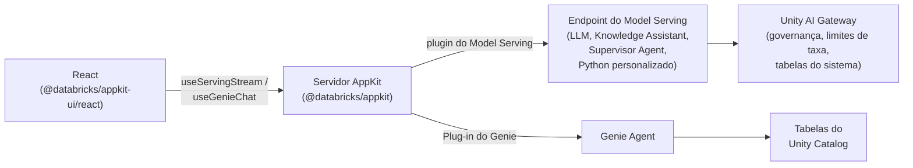

# O que é o Agent Bricks? \{#what-is-agent-bricks\}

O **Agent Bricks** é a plataforma corporativa de agentes da Databricks para criar, implantar e governar agentes que operam sobre os dados do seu negócio. Ele unifica acesso a modelos, execução, governança e contexto em um único sistema: do modelo que você chama, aos dados que seu agente lê, até a identidade sob a qual ele atua. No seu workspace, você configura Knowledge Assistants, Supervisor Agents e agentes Python personalizados. A Databricks cuida da avaliação, do ajuste e da melhoria de qualidade e, em seguida, hospeda cada agente em um endpoint HTTP que seu app pode chamar.

Para saber o que é o Agent Bricks e como desenvolver com ele, consulte a [documentação do Agent Bricks](https://docs.databricks.com/aws/en/agents/agent-bricks/) ou a agent skill [`databricks-agent-bricks`](/docs/tools/ai-tools/agent-skills).

Seu app AppKit se conecta aos recursos do Agent Bricks por meio do [plugin do Model Serving](/docs/appkit/v0/plugins/model-serving), para agentes, foundation models e endpoints governados, e do [plugin do Genie](/docs/appkit/v0/plugins/genie), para consultas em linguagem natural sobre tabelas do Unity Catalog.

## Como tudo se encaixa \{#how-it-fits-together\}

Seu app AppKit chama o Agent Bricks por meio de um **endpoint de Model Serving** (um foundation model, um Knowledge Assistant, um Supervisor Agent ou um agente Python personalizado) ou de um **Genie Agent** (consultas em linguagem natural sobre tabelas do Unity Catalog). O [plugin do Model Serving](/docs/appkit/v0/plugins/model-serving) e o [plugin do Genie](/docs/appkit/v0/plugins/genie) cobrem os dois casos.

## Plugins do AppKit para o Agent Bricks \{#appkit-plugins-for-agent-bricks\}

| O que você quer fazer                                                                    | Use este plugin | Auxiliar de frontend                   |
| ---------------------------------------------------------------------------------------- | --------------- | -------------------------------------- |
| Chamar um foundation model (LLM) com mensagens de chat                                   | `serving`       | `useServingStream`, `useServingInvoke` |
| Chamar um endpoint de agente (Knowledge Assistant, Supervisor Agent, Python personalizado) | `serving`       | `useServingStream`, `useServingInvoke` |
| Permitir que usuários consultem tabelas do Unity Catalog em linguagem natural             | `genie`         | `GenieChat`, `useGenieChat`            |

Escolha o plugin correspondente ao recurso. Nenhuma outra primitiva é necessária para a camada de IA.

## Auth \{#auth\}

Por padrão, as rotas HTTP de serving e do Genie são executadas em nome do usuário autenticado. Se o usuário não tiver `CAN QUERY` no endpoint de serving ou `CAN RUN` no Genie Agent, a chamada falha com um 403. Você não precisa escrever a verificação de permissão.

Para lógica de servidor fora de um handler de rota, chame `AppKit.serving("alias").asUser(req).invoke(...)` para manter o mesmo comportamento.

## Por que usar o AppKit em vez de `fetch` puro \{#why-appkit-instead-of-raw-fetch\}

Você poderia chamar um endpoint de serving diretamente com `fetch` e um token. O plugin não faz nada que você não possa fazer sozinho — ele faz estas coisas para que você não precise fazê-las:

- As rotas são executadas como o usuário autenticado, então as **permissões por usuário** valem automaticamente. Seus usuários só veem os endpoints e os dados que já têm permissão para ver. Sem código de OAuth do seu lado. Consulte [Contexto de execução](/docs/appkit/v0/plugins/execution-context) para os detalhes.
- Todo o **streaming** é tratado para você: parsing de SSE, cancelamento ao desmontar, acumulação de tokens e tratamento de erros. É isso que `useServingStream` e `useGenieChat` fazem.
- Nenhum **secret** no frontend. O plugin faz o proxy pelo seu servidor e os tokens permanecem no backend. Nenhum PAT no bundle React.
- Quando seu endpoint de serving publica um schema OpenAPI, o AppKit gera **aliases de endpoint tipados**, com tipos TypeScript de requisição e resposta para cada alias. Autocompletar para os formatos de chunk, em vez de `unknown`.

:::note[Criando um custom agent]

Criar um custom agent é um fluxo de trabalho em Python: a interface `ResponsesAgent`, um framework de agentes (OpenAI Agents SDK, LangGraph, LlamaIndex) e o MLflow para tracing. Consulte [Author an AI agent](https://docs.databricks.com/aws/en/agents/custom-agents/author-agent).

:::

## Escolha um template para começar \{#pick-a-template-to-start-from\}

Comece por um template que corresponda ao seu caso de uso. Cada um deles já inclui a integração do plugin do Model Serving ou Genie, uma vinculação de recurso no `app.yaml` e uma interface funcional que você pode adaptar.

| Você quer...                                              | Template                                                   |
| --------------------------------------------------------- | ---------------------------------------------------------- |
| Adicionar um chatbot com streaming ao seu app             | [AI Chat App](/templates/ai-chat-app)                      |
| Permitir que usuários consultem tabelas em linguagem natural | [Genie Analytics App](/templates/genie-analytics-app)      |
| Adicionar alternância entre múltiplos agentes Genie a um app existente | [Genie Multi-Agent Selector](/templates/genie-multi-space) |

## Próximos passos \{#where-to-next\}

- [Unity AI Gateway](/docs/agents/ai-gateway) para acesso governado a modelos, endpoints de agentes e ferramentas externas.
- [Genie Agents](/docs/agents/genie) para conversar com seus dados em tabelas do Unity Catalog.
- [Endpoints de custom agents](/docs/agents/custom-agents) para integrar o Knowledge Assistant, o Supervisor Agent ou seu próprio agente em Python.